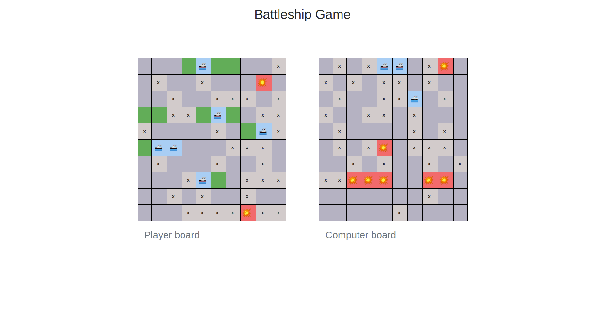

# Battleship Game

## Technologies

- HTML
- CSS
- JavaScript
- Webpack

## Functionalities

Can be found on: ( <a href="https://www.theodinproject.com/courses/javascript/lessons/battleship">  Battleship (The Odin Project) </a>)

## Users Can: 
Play against a computer with two boards.

## Developed by

Mouhamadou Diouf ( <a href="https://github.com/MouhaDiouf"> @mouhad </a>)
Michael Damulak ( <a href="https://github.com/em-em-D"> @em-em-D </a>)

## How to start the game
1. Clone it (git clone git@github.com:MouhaDiouf/battleship.git)
2. Excecute it with a live server (from your code editor)

## Live Version
Live version can be found here: <a href="https://mouhadiouf.github.io/battleship/dist/"> Battleship Game </a>

## Contributing

1. Fork it (https://github.com/MouhaDiouf/battleship)
2. Create your feature branch (git checkout -b feature/[choose-a-name])
3. Commit your changes (git commit -am 'What this commit will fix/add')
4. Push to the branch (git push origin feature/[chosen name])
5. Create a new Pull Request
